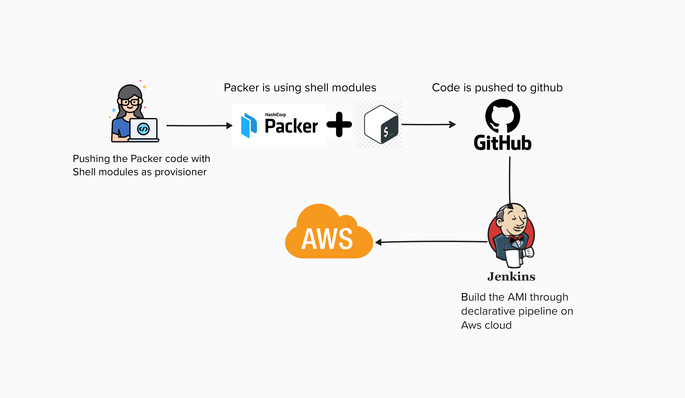
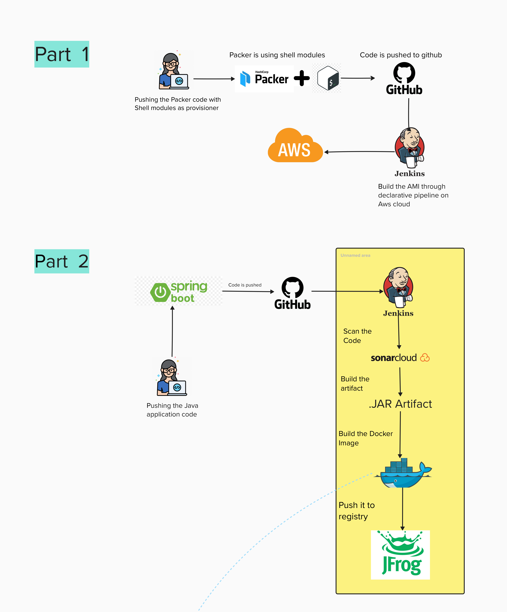
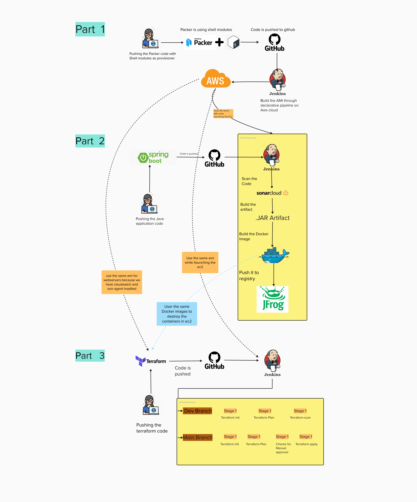

# Project Title: Infrastructure Deployment using IaC and CI/CD Pipeline Implementation

## Project Description:

## Overview
This project is a proof of concept commissioned by a client to demonstrate the ability to build a scalable and secure infrastructure using Infrastructure as Code (IaC) practices on AWS/Azure and establish a robust DevOps pipeline for building and deploying a Java application. The project is divided into three main parts: creating a base Amazon Machine Image (AMI) using Packer, containerizing a Java application and implementing a CI/CD pipeline, and deploying the infrastructure using Terraform.

## Why Are We Doing This Project?
The industry values hands-on experience in DevOps and Cloud, as these are specialized and vast fields. Traditional academic courses and Zero to Hero tutorials often fall short in providing the practical, real-world skills necessary for professionals to stand out. This project aims to bridge that gap by offering practical experience in key DevOps and Cloud concepts, allowing professionals to build their GitHub repositories with quality projects that demonstrate their skills.

##  Who This Project Is Suitable For:
1. Freshers and Entry-Level DevOps and Cloud Engineers: Those with some basic knowledge and hands-on experience in simpler projects.
2. Experienced IT Professionals Transitioning to DevOps and Cloud: Individuals looking to switch their career path to DevOps and Cloud.
3. Experienced IT Professionals in DevOps and Cloud: Those seeking to enhance their skills with more advanced projects.

## Project Breakdown:

## Part 1: Creation of a Base AMI using Packer
**Objective:** Build a base AMI with the required software pre-installed.
**Estimated Time:** 3 Days
**Tools:** Packer, AWS/Azure
**Software to be Installed:**
1. CloudWatch Agent
2. AWS SSM Agent
3. Docker
4. Git Client
**Provisioning:** Use shell script for beginners and Ansible for more experienced participants.
**CI Tool:** Any CI tool of choice (e.g., Jenkins, GitHub Actions) to build the Packer pipeline.

## Part 2: Containerizing a Java Application and Implementing a CI/CD Pipeline
**Objective:** Build and containerize a Java application, scan the code, and push the container to a repository.
**Estimated Time:** 5 Days
**Tools:** GitLab, Azure DevOps, Jenkins, GitHub Actions, JFrog Artifactory, SonarCloud
**Steps:**
1. Containerize the application using Docker.
2. Implement a CI/CD pipeline to build the application and produce a container image.
3. Scan the code and Docker files using SonarCloud.
4. Push the container image to JFrog Artifactory.

## Part 3: Deploying Infrastructure Using Terraform
**Objective:** Deploy a secure, scalable infrastructure.
**Estimated Time:** 12 Days
**Tools:** Terraform, AWS/Azure
**Infrastructure Components:**
1. VPC with Public, Private, and Secure subnets
2. Load Balancer in Public Subnet
3. Auto Scaling Group in Private Subnet
4. RDS Cluster in Secure Subnet
**Best Practices:**
1. Store state in S3/Azure Blob with cross-region replication and encryption.
2. Enable state locking using DynamoDB.
3. Use the GitOps approach for Terraform to apply on merge to the main branch.

## Key Requirements:
**Base AMI:** Must include essential software and be built using Packer.
**Application Build:** Should follow best practices with code scanning and containerization.
**Infrastructure:** Should be deployed following industry best practices, ensuring security and scalability.

## Reference Architectures and Pipelines:
**AMI Creation:** Reference architecture available on GitHub.

  

**Application Build:**  Use the Spring Petclinic repository or any similar Java application.

  

**Infrastructure Deployment:** Follow the provided reference architecture for setting up VPC, subnets, and other components.

  

---
The project is divided into three parts
|[Part 1](https://github.com/AnirudhBadoni/Packer.git)|[Part 2](https://github.com/AnirudhBadoni/Petclinic.git)|[Part 3](https://github.com/AnirudhBadoni/AwsInfra.git)|
|---|---|---|
---

